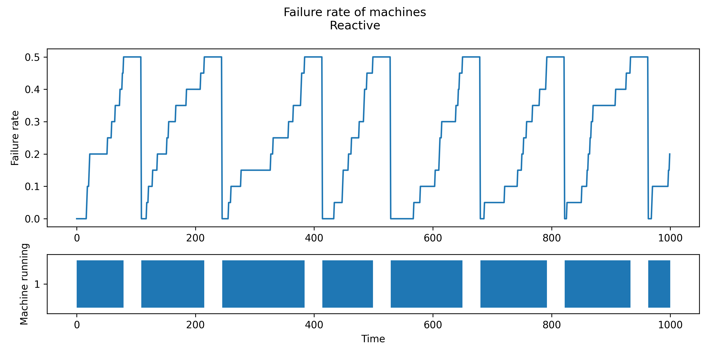
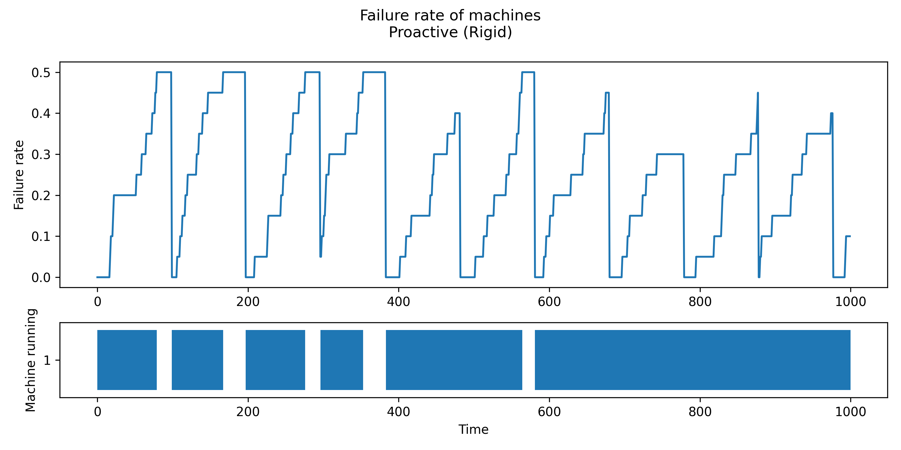
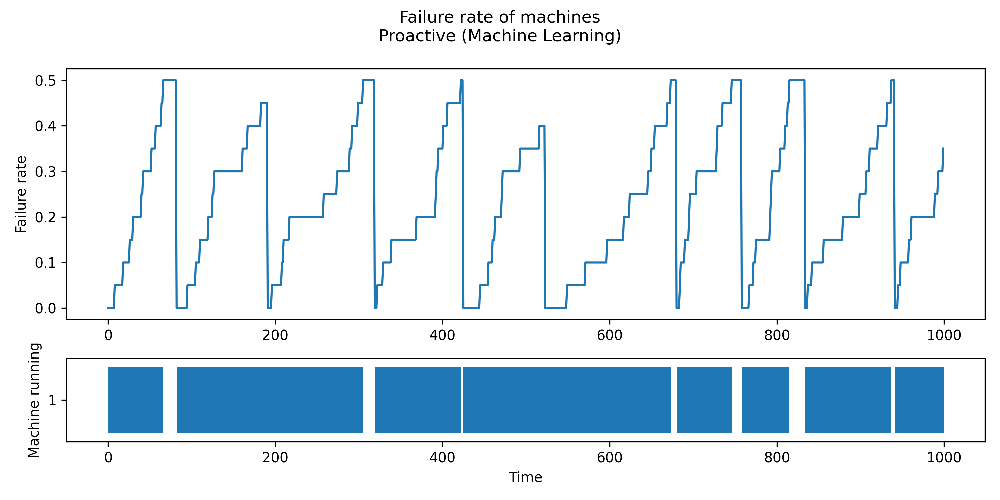

# Maintenance of production machines in a factory 

In this example, we use the ML-DEECo framework to implement a simulation of a scenario with failing production machines which need maintenance. 

In this document, a simple guide to run the example is presented:

- [Installation](#installation)
- [Usage](#usage)

## Installation

The example requires Python 3 with `numpy`, `tensorflow`, `matplotlib` and `seaborn` libraries installed.

Furthermore, `ml_deeco` shall be installed to run the simulation (the `--editable` switch can be omitted if one does not plan to change the code of ML-DEECo):

```
pip install --editable ../ml_deeco
```

## Usage

To run the experiments presented in the paper, use the following two commands.

The first command runs the *Reactive* scenario and uses the data collected during the simulation to train the ML model and then run the *Proactive (Machine Learning)* scenario:

```
py run.py -o results/reactive
```

The second command runs the *Proactive (Rigid)* scenario.

```
py run.py -i 1 -b -o results/proactive
```

The semantics of the options is as follows:

* `-o results` defines the folder to save results to,
* `-i 1` sets the number of iterations (default is `2` for the *Reactive* and *Proactive (Machine Learning)* scenarios ran together),
* `-b` enables the *Proactive (Rigid)* baseline (without it, the reactive baseline is used).

Other options include:

* `-v` to set the verbosity level (default is `2`),
* `--seed` to set the random generator seed,
* `--threads` to se the number of threads used by TensorFlow (default is `4`).

The experiments produce the following charts as results. They are described in more detail in the paper. The running times of machines are printed to the standard output. 





## Simulation configuration

Some aspects of the simulation can be configured in the [configuration.py](configuration.py) file. These include:

* the number of steps of the simulation (`steps = 1000`),
* the failure rate threshold to shut off the machine (`failureThreshold = 0.499`),
* time to repair the machine when maintenance is called (`timeToRepair = 30`),
* and the number of machines (`machineCount = 100`).
